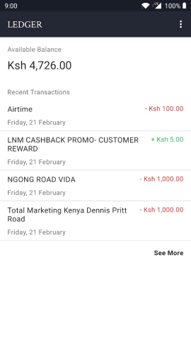

# Ledger

A ledger app for M-Pesa.  

Ledger works by reading M-Pesa messages and extracting key data from them.

## Features

- Get balance
- View all M-Pesa transactions
- Filter by text and/or date.
- Export as CSV

## Download

Head over to [Releases](https://github.com/MarkNjunge/Ledger/releases) to download the latest version or click [this link](https://barbet.marknjunge.com/ledger) to download the latest build.

## Screenshot

